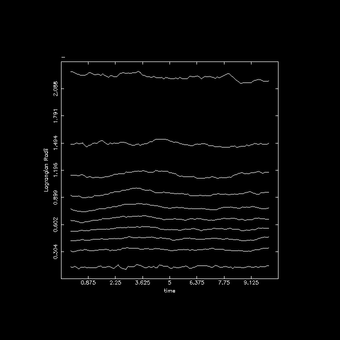

# The NEMO package (example report)

[1] NEMO: Where is the fish?

    Peter Teuben - May 14, 2025.

[2] The NEMO package is a software toolbox written primarely in C, with
some code in C++ and Fortran, and thus not suitable for PHYS265. It
provides a library, with which new programs can be written. The
philosophy of this is to emulate the Unix environment, whereby each
program provides a unique function, and using Unix pipes a filter can
be created to solve astrophysical problems, in particular the N-body
problem in the case of NEMO.  Other tools were developed to work on
orbits, images and tables, making it a very versatile environment to
solve a variety of astrophysical simulations. Users typically write
shell scripts (bash or python) to use NEMO.


[3] I picked this package because I was one of the co-authors and wanted
to provide an example of such a report for the 265 final project. The 265
projects have to be python based, and although NEMO does have example
code in python, it does not rely on it. 

[4,5] NEMO was written in 1986, by Barnes, Hut and Teuben at the Institute
for Advanced Study in Princeton. It has been maintained by
Teuben ever since, although Barnes developed NEMO into ZENO and still
maintains that. Hut wanted to solve a different type of N-body problem and wrote
the Starlab package with McMillan, Makino and others.  The Starlab
package then evolved into the AMUSE package, which is a very versatile
python package that could be used as a (challenging) PHYS265 project!

There are actually many N-body codes that have been written, a large
number can be found on ASCL (both using the term nbody and n-body),
a number of them are available through NEMO, so interesting comparisons
can be made.

NEMO's  version is contained in the VERSION file, and was labeled 4.5.3

The file CONTRIBUTING.md contains (github) instructions how to contribute
to the code.

[6] Although installing these types of packages can be notoriously hard on
Unix, NEMO was relatively easy to install because the libraries needed
(mostly the PGPLOT plotting library) are generally available on Linux
and Mac.  The authors have also gone through great length to use
the autoconf library to simplify the install and solve some of the common
dependancies. The install took about two minutes.

```
    git clone https://github.com/teuben/nemo
    cd nemo
    ./configure
    make build check bench5
    source nemo_start.sh
```

after this NEMO commands such as `mkplummer` can be used.  The accompanying
notebook shows this is more detail.

[7] There is a small python component in NEMO, which can be installed with the
typical pip install command, but from the command line

```
     cd $NEMO
     pip install -e .
```

[8] Source code is available on github (see item 50.
There are currently no binaries available. Making for example a docker
image available could help lowering the barrier to use it.  After the
package was installed, a runtime check and benchmark were suggested to
be used to confirm the package was correctly installed, and provide
an idea how fast the computer is.

[9] Parts of NEMO are also used by galpy, notably the flexible way to
describe potentials. The glnemo2 visualization software and the unsio
library also use the NEMO file format to describe visualize an N-body system.

[10] In my example notebook I use the `bash` scripting language
in a Jupyterlab Desktop (JDL) bash, but here is a one line example how to
create a Plummer sphere with 10 particles and print the positions
and velocities:

```
     mkplummer - 10 | snapprint - 
```

also showing how Unix pipes can be use in NEMO.

[11] The accompanying notebook shows how I have used the classic Aarseth code, but
integrated into NEMO. It is a `bash` notebook, not `python` for obvious reasons.

[12] NEMO programs use the `yapp` API to produce figures. At installation time
the user needs to select a working yapp interface. I selected the pgplot interface,
because it can at run time select an X11, or PNG or PS output device. For the
generic `tabplot` table plotter program, there was also a simple matplotlib based
tabplot.py available, which is OK for some interactive plotting, but is not mature
yet.

[13] here is a figure of the Lagrangian radii showing 1,10,20,...90,99% of the total mass
as function of time in a 2048 Plummer simulation, made with nbody1.



[14] There is still very little python in NEMO, most work is done via
Unix style commands, and users writing shell scripts for their workflow.

[15] The input for NEMO can be an image, an N-body snapshot or most ascii table formats.
Some programs exist to create such data from scratch, e.g. `ccdgen`, `mkplummer`, or `tabgen`.
NEMO can read and write FITS files.

[16] The output is likewise. image (including FITS), snapshots, tables and orbits can be produced.


[17,18]  After the code was installed, it was suggested to run the commands

```
      make check bench5
```

which run a standard set of tests and benchmarks to make the user more confident
the code is working and producing the correct answers. The contents of the data
files are compared (on a statistical level) with a baseline version using the
NEMO `bsf` program. Relying on the benchmark here to ensure it is working.

[19] NEMO does use matplotlib and numpy, but the main package depends on a plotting
library (often pgplot) and optionally on a number of scientific libraries such as
hdf4, hdf5, cfitsio, netcdf, gsl. 

[20] The documentation was extensive. NEMO still uses the Unix man format, accessible
via the `man` command, but these manual pages are also available in html, and include
hyperlinks on https://teuben.github.io/nemo/man_html/index1.html.
An original latex based manual was converted to `readthedocs` (built by python) and probably
provides the best introduction to the package. https://astronemo.readthedocs.io/en/latest/
There was also a Software Carpentry style introduction, and of course the bash notebooks.
It also means there is some redundancy in the documentation.


[21,22] References

- NEMO preferred citation: https://ui.adsabs.harvard.edu/abs/1995ASPC...77..398T
- zeno:    https://ascl.net/zeno
- starlab: https://ascl.net/starlab
- AMUSE:   https://ascl.net/amuse
- glnemo2: https://projets.lam.fr/projects/glnemo2/wiki
- unsio:   https://projets.lam.fr/projects/unsio/wiki/Wiki
- pgplot:  https://ascl.net/pgplot
- galpy:   https://ascl.net/galpy

[23] Using ADS only two were identified in the ASCL reference:
https://ui.adsabs.harvard.edu/abs/2010ascl.soft10051B/citations
But on the actual originating 1995 paper there are 179 citations:
https://ui.adsabs.harvard.edu/abs/1995ASPC...77..398T/citations

This shows one of the complaints of software being in two references on ADS.

[24] Not applicable to me, so the answer is no. there was nothing new here.

[25] I've used NEMO extensively, both as author and user.

